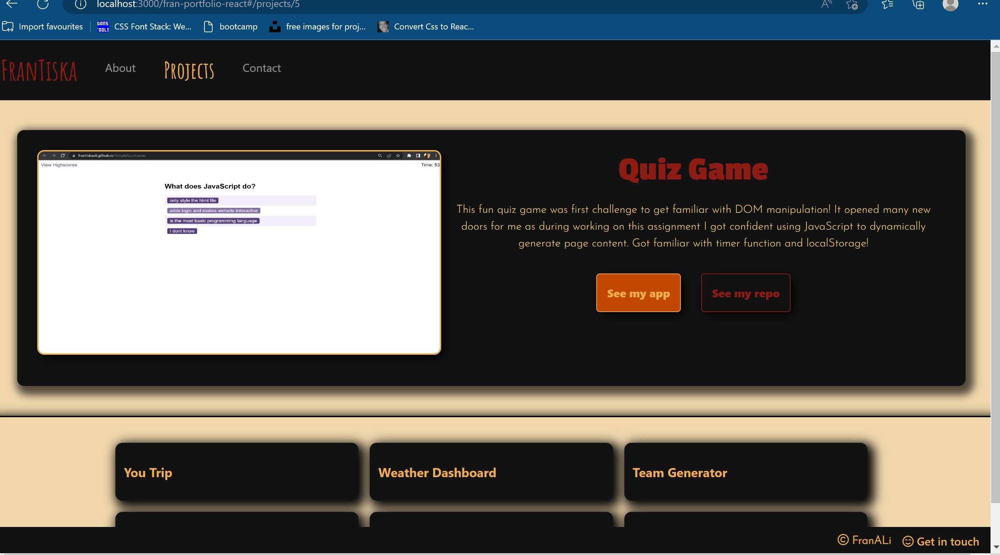

# React Portfolio 

## Table of content
- [Installation](#Installation)
- [Usage](#Usage)
- [License](#License)
- [Questions](#Questions)
## Description
This is portfolio that showcases all of my work throughout my edX Frontend web-dev Bootcamp. It was made using react.js, react router-dom and Bootstrap.
 [HERE](https://frantiskaali.github.io/fran-portfolio-react/) You can find my deployed application!

### While working on this app I learned
- How to use react.js
- How to deploy react app in github
- I really practiced my CSS knowledge , focusing on animations
- Bootstrap
## Installation
No need to install when seen in the browser. In local computer npm install needed
## Usage
Browse through my work. Website is fully interactive.
## License
GNU General Public License v3.0 is used on this project.
## Future development
I would like to keep this portfolio and update it with my work. I would like to change my CSS animation to animation used with bootstrap hooks.

## Questions
If you have any more questions for the project you can always contact me on my [email](mailto:tiskarechk@gmail.com).  
[HERE](https://github.com/FrantiskaAli) is link to my github account. 
